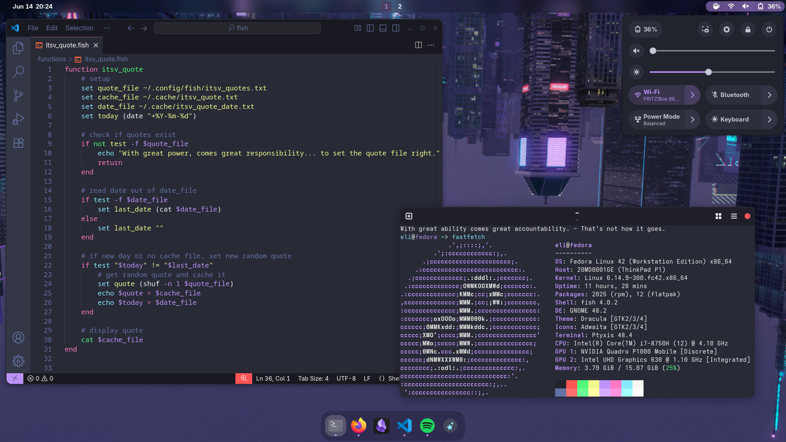
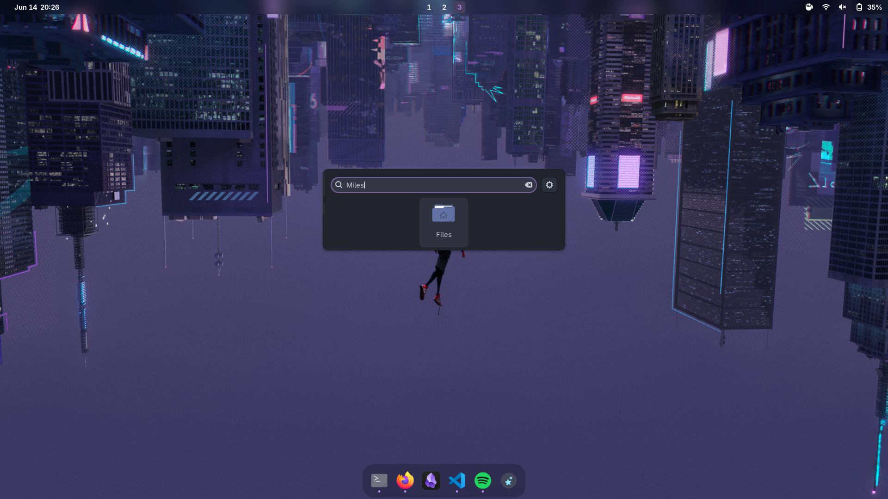
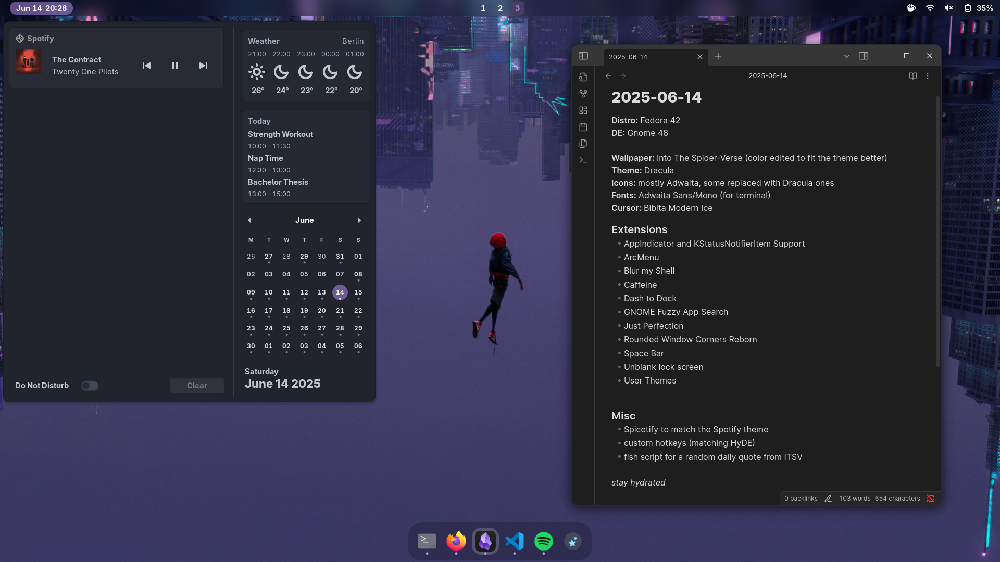

# Into The Spider-Verse Dotfiles 

---

---

---

## Installation
> ⚠️ The setup script has not yet been tested!

Installation of packages is done with the `dnf` package manager. If you're using GNOME on a Linux distribution with a different package manager, edit the [installation script](./scripts/setup.fish) accordingly.

### 1. Clone the repository into your `$HOME` directory
`git clone https://github.com/Elinteger/itsv-dots.git ~/dotfiles`

This clones the repository into `~/dotfiles`, which both `gnu stow` and the [installation script](./scripts/setup.fish) expect. 

### 2. Run the Setup Script
Go into the directory of the [installation script](./scripts/setup.fish).

`cd ~/dotfiles/scripts/`

Set permission to execute.

`chmod +x setup.fish`

Run the script.

`./install-packages.fish`

## Applications and Extensions
Besides installing themes, configs and settings, these dots also install a few applications. Some are required for setup, while others are included by default based on personal preference. 

- Curl
- fish (Shell)
- Fastfetch
- GNOME Extension Managaer
- GNOME Tweaks
- Spotify + Spicetify
- Stow
- Syncthing

---

For the visual customization ("rice"), serveral [GNOME Shell extensions](./scripts/extensions.txt) are used and installed automatically.

- AppIndicator and KStatusNotifierItem Support
- ArcMenu
- Blur my Shell
- Caffeine
- Dash to Dock
- GNOME Fuzzy App Search
- Just Perfection
- Rounded Window Corners Reborn
- Space Bar
- Unblank lock screen
- User Themes

---

As part of the rice, I wrote a [script](./.config/fish/functions/itsv_quote.fish) which picks a random "Into the Spider-Verse" quote each day and displays it as a greeting every time you open the terminal. Additional quotes can be added [here](./.config/fish/itsv_quotes.txt).

## Keybindings
The dotfiles come with a set of custom hotkeys inspired by [HyDE](https://github.com/HyDE-Project/HyDE).

### Launching Applications
| Keybinding                      | Action                |
| ------------------------------- | --------------------- |
| <kbd>SUPER</kbd> + <kbd>A</kbd> | Application Finder    |
| <kbd>SUPER</kbd> + <kbd>E</kbd> | Explorer (in `$HOME`) |
| <kbd>SUPER</kbd> + <kbd>T</kbd> | Terminal              |
| <kbd>SUPER</kbd> + <kbd>B</kbd> | Internet Browser      |
| <kbd>SUPER</kbd> + <kbd>C</kbd> | Visual Studio Code    |

### Actions
| Keybinding                          | Action                             |
| ----------------------------------- | ---------------------------------- |
| <kbd>SUPER</kbd> + <kbd>L</kbd>     | Lock screen                        |
| <kbd>SUPER</kbd> + <kbd>Tab</kbd>   | Swap application                   |
| <kbd>SUPER</kbd> + <kbd>Q</kbd>     | Close currently active application |
| <kbd>SUPER</kbd> + <kbd>H</kbd>     | Hide currently active application  |
| <kbd>SUPER</kbd> + <kbd>Print</kbd> | Take screenshot                    |
| <kbd>SUPER</kbd> + <kbd>Y</kbd>     | Toggle Caffeine                    |

### Navigation
| Keybinding                                                             | Action                                        |
| ---------------------------------------------------------------------- | --------------------------------------------- |
| <kbd>SUPER</kbd> + <kbd>Left</kbd>                                     | Move to workspace on the left                 |
| <kbd>SUPER</kbd> + <kbd>Right</kbd>                                    | Move to workspace on the right                |
| <kbd>SUPER</kbd> + <kbd>1</kbd>                                        | Switch to workspace 1                         |
| <kbd>SUPER</kbd> + <kbd>2</kbd>                                        | Switch to workspace 2                         |
| <kbd>SUPER</kbd> + <kbd>3</kbd>                                        | Switch to workspace 3                         |
| <kbd>SUPER</kbd> + <kbd>4</kbd>                                        | Switch to workspace 4                         |
| <kbd>SUPER</kbd> + <kbd>N</kbd>                                        | Switch to empty workspace                     |
| <kbd>SUPER</kbd> + <kbd>CTRL</kbd> + <kbd>ALT</kbd> + <kbd>Left</kbd>  | Move window to workspace on the Left          |
| <kbd>SUPER</kbd> + <kbd>CTRL</kbd> + <kbd>ALT</kbd> + <kbd>Right</kbd> | Move Window to workspace on the Right         |
| <kbd>SUPER</kbd> + <kbd>CTRL</kbd> + <kbd>Left</kbd>                   | Split view of active application to the left  |
| <kbd>SUPER</kbd> + <kbd>CTRL</kbd> + <kbd>Right</kbd>                  | Split view of active application to the right |
| <kbd>SUPER</kbd> + <kbd>M</kbd>                                        | Toggle maximalization of active application   |